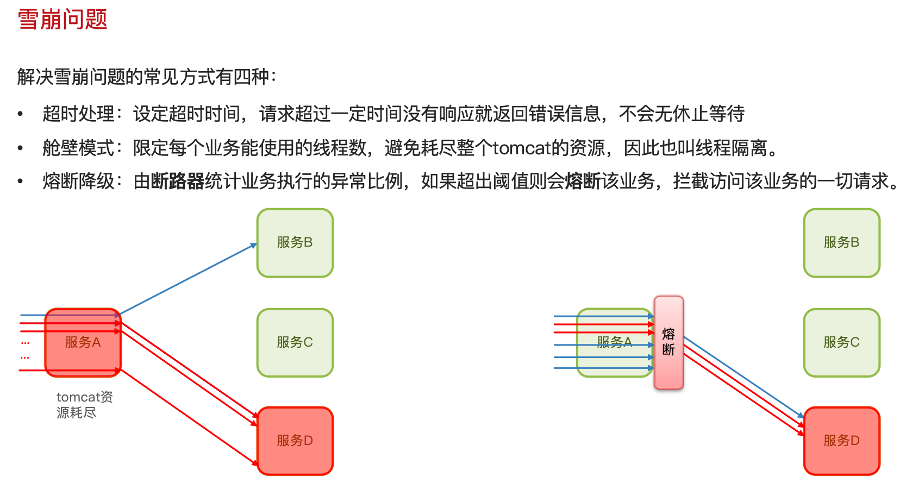
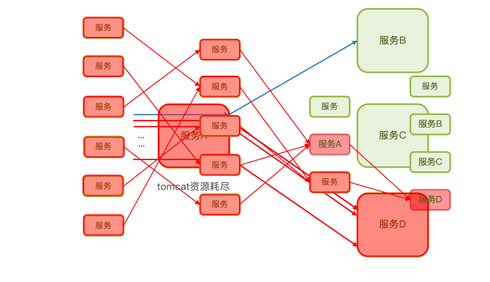
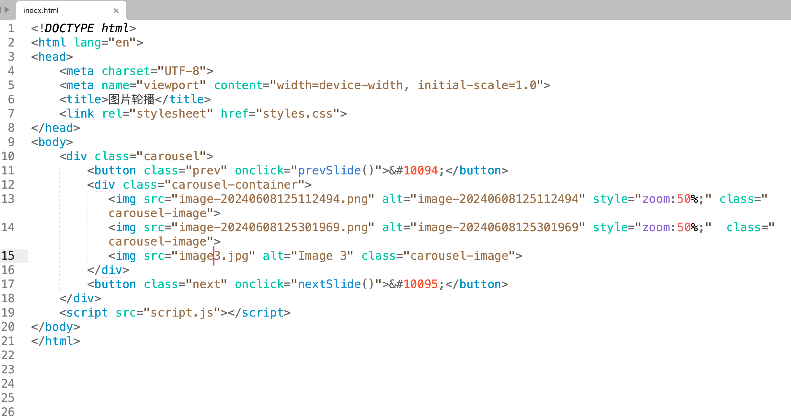

<!-- 引入样式表 -->
<link rel="stylesheet" href="{{ '/assets/styles.css' | relative_url }}">

    

        
        
        
    

    

        <button class="prev" onclick="prevSlide()">&#10094;</button>
        

            1 / 3
        

        <button class="next" onclick="nextSlide()">&#10095;</button>
    

<!-- 引入脚本文件 -->

测试一下了
